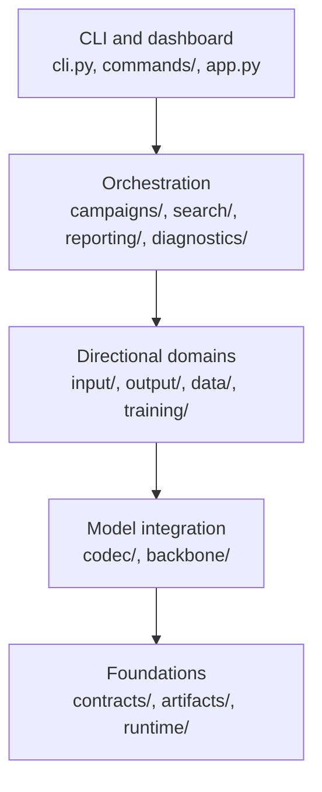
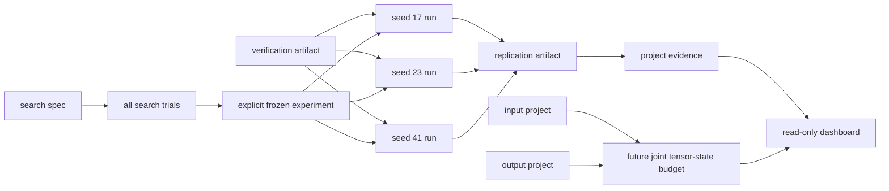

# Continuous Byte Tokenizer Project Charter

## Project Definition

This repository researches orthogonal input-only and output-only continuous byte tokenizers around
a frozen language-model backbone.

The input tokenizer maps a discrete variable-length byte span to one continuous token represented
by a generated latent vector in the model's input embedding space. Each continuous token occupies
one global model position and has no discrete token ID or codebook entry. A local decoder must
reconstruct the exact original bytes before that span is accepted. The existing backbone consumes
the latent vectors through `inputs_embeds`.

Input-only maps bytes to `inputs_embeds` and retains a local decoder only for reconstruction
validity. Output-only maps final hidden states directly to variable non-empty byte spans or
structural controls, bypasses the native vocabulary head, and feeds emitted bytes back through
deterministic native-token segmentation. A combined input+output mode remains deferred.

## Terminology

- **Tokenizer** means one complete directional system. Input-only includes byte runs, structural
  control-token bypass, exhaustive segmentation, latent vectors, exact reconstruction checks,
  and encoding cache. Output-only includes byte/control events, exact native feedback segmentation,
  and semi-autoregressive macro-steps.
- **Byte-span codec** means only the reversible neural component that maps one candidate span from
  bytes to a latent vector and back to bytes.
- **Byte sequence** and **byte span** mean discrete byte values and discrete boundaries.
- **Continuous token** means one accepted ordinary byte span occupying one model input position. It
  is represented directly by a generated latent vector, not by a learned discrete token ID or
  quantized codebook entry.
- **Latent vector** or **latent embedding** means the continuous-valued model-width representation
  of one continuous token.
- **Native token** means a discrete vocabulary ID selecting a frozen input-table row or native
  output-head entry.
- **Segmented input path** means reconstruction-gated byte-span segmentation. The
  **compatibility path** emits one continuous token for each native ordinary-token payload.
- **Source** identifies provenance, the source model, or its frozen input table. Runtime discrete
  tokens and tokenizer behavior are **native**, not source.
- Public commands, checkpoints, artifacts, and claims must use **tokenizer**. Internal component
  names and component-level measurements may use **codec**.

## Architecture

Imports point downward through dependency-directed layers:



- `contracts/` is immutable and standard-library-only.
- `artifacts/` owns atomic storage, hashes, source identity, and manifest loading.
- `runtime/` owns device, compiler, timing, tensor accounting, progress, and resume policy.
- `codec/` and `backbone/` cannot import orchestration, reporting, or UI.
- `input/` and `output/` are independent directional domains.
- `campaigns/` alone coordinates loading, training, evaluation, gates, and publication.
- `reporting/` reads stored artifacts and must not import Torch, codecs, or campaigns.
- `commands/` contains handlers; `cli.py` preserves the public parser and dispatch surface.

The two supported directions share a frozen backbone but not a combined tokenizer:

```mermaid
flowchart TB
    subgraph INPUT["Input-only"]
        IB["bytes or controls"] --> IS["structural split"]
        IS -->|control| IR["exact frozen input row"]
        IS -->|byte run| IC["exhaustive span candidates"]
        IC --> IV["exact local decode check"]
        IV --> IG["longest valid span<br/>atomic-byte fallback"]
        IG --> IE["latent vectors in inputs_embeds"]
        IR --> FB["frozen backbone"]
        IE --> FB
    end

    subgraph OUTPUT["Output-only"]
        FH["frozen hidden state"] --> OC["output codec"]
        OC --> OE["non-empty bytes or control"]
        OE --> NS["deterministic native segmentation"]
        NS --> FI["exact feedback token IDs"]
        FI --> FB2["frozen backbone"]
        FB2 --> FH
    end
```



## Protocol Invariants

- The codec input alphabet must contain exactly the 256 byte values `0..255`.
- Accepted byte spans must become continuous tokens represented by latent vectors, not learned
  discrete token IDs or a quantized codebook.
- The local decoder must output those 256 bytes plus one private `CODEC_EOS` symbol.
- `CODEC_EOS` exists only inside the local decoder. It has no input embedding and must never enter
  the language model.
- Arbitrary binary data must be supported. Text encodings such as ASCII, UTF-8, UTF-16, and UTF-32
  are byte sequences, not special cases.
- Model control tokens must be identified structurally. They must bypass the codec and use exact,
  frozen rows from the original input table.
- Every atomic byte must use its exact original embedding and must remain a guaranteed lossless
  fallback.
- A span is valid only when deterministic decoding reproduces its payload and terminates at the
  correct `CODEC_EOS`.
- Span validity is non-monotonic. Failure at one length must not prune any longer candidate.
- Greedy segmentation must evaluate every candidate length at the current offset and select the
  longest valid span. It must fall back to one atomic byte when none is valid.
- The encoding cache may change latency only. It must not change validity, segmentation, metrics,
  or acceptance.

## Training Boundary

Only the continuous tokenizer may be trained.

The following must remain frozen:

- The source input embedding table used as supervision.
- All copied byte and control-token embeddings.
- The language-model backbone.
- The language-model output head.
- The model's output tokenizer.

Vocabulary training intentionally overfits ordinary source rows:

```text
bytes(native token) -> codec encoder -> source input embedding
```

Vocabulary fitting must be sequential. First select one complete tokenizer checkpoint by encoder
alignment, then freeze that selected encoder and train the decoder from its actual latent outputs.
Checkpoint selection must always restore a complete codec state; encoder and decoder weights from
different epochs must never be merged.

Reconstruction must freeze the selected encoder and train only the decoder with the replay fraction
declared in the experiment spec, so embedding alignment cannot regress. The pre-registered default
is 75% vocabulary spans and 25% arbitrary spans. Current default campaigns end after vocabulary
and reconstruction training. Explicit diagnostic or feasibility studies may run frozen-backbone
distillation; when they do, only the encoder may train, the selected decoder remains frozen, and
reconstruction loss regularizes encoder movement. Code must verify the model's parameter
fingerprint and trainable parameter names before and after such work.

## Research Hypotheses

The primary current input hypothesis is **usable exact held-out position compression**. It is
supported only when held-out bytes round-trip exactly, the registered native-to-continuous position
ratio passes, and the prospectively registered frozen-model behavioral-similarity tolerances pass.
Qwen and Gemma remain equal primary models for this result. No completed fixed-seed real-model
artifact currently supports it.

The input-only project reports its operands and independent findings separately:

1. Exact held-out round-trip and native positions per continuous position.
2. Prospectively registered frozen-model behavioral similarity.
3. Full-vocabulary embedding compatibility and prospective alignment feasibility, independently
   from the headline.
4. Prompt-cache, latency, codec-state, and global-compute effects as secondary claims.

Research throughput is operational evidence only. Tokenizer latency, direct end-to-end
time-to-first-logit, prompt-cache bytes, and compute are secondary deployment-performance claims
eligible only from complete final artifacts. They require the corrected condition matrix, raw
observations, registered warmups and repetitions, exact semantic digests, valid denominators,
uncontaminated execution, and every registered gate. Missing or contaminated evidence is
incomplete; a measured regression is unsupported. Optimization ablations remain operational and
secondary evidence and cannot promote final claims alone. The joint tensor-state budget remains a
future prerequisite and gains no support from runtime or cache speedups.

The performance floors remain five warmups and twenty repetitions. Current default final runs use
one warmup and two repetitions, so tokenizer-latency and direct time-to-first-logit claims remain
incomplete unless an explicit full-performance run is produced. Reduced execution work is not
deployment-speed evidence and cannot substitute for exact held-out position compression or
registered behavioral similarity.

Behavioral similarity uses prospectively registered tolerances. Reports must publish
KL, JS divergence, top-1 agreement, likelihood, and generation measurements. Passing those
tolerances supports only the registered comparative-similarity claim; it is not a non-inferiority
result and must never be described as one.

The output-only project tests whether the tokenizer can:

1. Predict the exact next non-empty byte span or structural control.
2. Preserve exact native-token feedback for every emitted byte span.
3. Emit more than one byte per global decoding step on held-out text.
4. Bypass the native vocabulary head with a smaller deployed output codec.

Approximate embedding fit must not be described as lossless table compression. Source-dtype exact
equality, reconstruction, behavioral similarity, density, memory, and compute are separate claims
and must be reported separately.

The primary future hypothesis is joint ordinary-vocabulary tensor-state budget and removal. First,
the complete input codec, output codec, atomic-byte rows, and deduplicated shared control state must
fit within the registered reference tensor-state budget for both primary models at seeds `17`,
`23`, and `41`. This sealed arithmetic artifact is a future prerequisite only. It must retain five
explicit `false` flags for combined runtime, continuous feedback, physical omission, resident-memory
reduction, and peak-memory reduction. A passing ratio must never be described as a measured memory
saving or physical removal. Those require a later joint-runtime and clean-load experiment.

Known-token compatibility applies to reachable canonical byte payloads. If multiple ordinary
source rows decode to the same bytes but have different embeddings, one deterministic
`bytes -> latent` mapping cannot reproduce all aliases simultaneously. Such ambiguity must remain
visible as a separate unsupported or inapplicable finding; it must never be hidden by relabeling
ordinary aliases as structural controls.

## Model Roles

- [`Qwen/Qwen3.5-0.8B`](https://huggingface.co/Qwen/Qwen3.5-0.8B) and
  [`google/gemma-3-270m-it`](https://huggingface.co/google/gemma-3-270m-it) are equal primary
  models. Each directional project verdict requires an independent Large-profile final replication
  at seeds `17`, `23`, and `41` for both models.
- Qwen's tied table cannot be removed in output-only mode because native input feedback still
  requires the shared rows. Physical omission is therefore derived from sealed deployment
  applicability and may be inapplicable without failing another claim.
- Gemma requires accepted model access. Missing Gemma evidence leaves cross-model project evidence
  incomplete; it is not an optional confirmation.

Models with one billion or more parameters are out of scope for this local Phase I artifact.

Acceptance must report each hypothesis separately. A model must not fail an overall verdict merely
because a claim is structurally inapplicable to it.

Qwen's tied input/output table makes physical input-table removal and physical native-head omission
inapplicable while native feedback remains required. This applicability finding remains independent
from state compactness, behavioral similarity, and position-compression claims.

Pinned sources for real artifacts are:

- Qwen revision `2fc06364715b967f1860aea9cf38778875588b17`.
- Gemma revision `ac82b4e820549b854eebf28ce6dedaf9fdfa17b3`.
- WikiText revision `b08601e04326c79dfdd32d625aee71d232d685c3`.

## Evidence Contract

- Experiment specifications, revisions, seeds, search budgets, and gates must be fixed before real
  results are observed.
- Acceptance thresholds must not be weakened after observing outcomes.
- Final evidence must include seeds `17`, `23`, and `41`; every seed and failed trial must remain
  visible.
- Search trials select configurations but are not final evidence.
- Run directories and published artifacts must be append-only and content-addressed where practical.
- Checkpoints must exclude ordinary rows from the original vocabulary table.
- Manifests must record source state, dependency lock, environment, device, revisions, tensor name,
  dtype, trainable parameters, and artifact hashes.
- Operational status and scientific verdict must remain distinct. A completed experiment may
  conclude that a hypothesis is unsupported. Only an execution error is a failed run.
- Reports must publish raw metrics and unsupported claims, not only favorable summaries.
- A preflight verification artifact must match the run's source-state and dependency-lock hashes.
  Start and final manifests must record whether it was provided and every check it ran.
- A deterministic synthetic campaign must pass before real-model execution. Synthetic results are
  software evidence, not evidence for the real-model hypotheses.
- Attention visualizations are optional diagnostics. Their eager backend and materialized attention
  weights must not contribute to model-quality, memory, compute, or latency claims.

Evidence moves through immutable, source-bound stages:



Search trials choose a configuration but never become final evidence. Every arrow that creates an
artifact is append-only; changed source, dependencies, or experiment contracts require a new output
directory.

## Current State

The repository is a v0.1 research implementation. It contains separate input and output byte
codecs, exhaustive greedy segmentation, encoding-only cache, frozen-backbone integration,
directional training and generation, strict experiment artifacts, reporting, and offline tests.

Hugging Face model-family differences must pass through shared pure helpers for effective text
configuration, model construction, tied embeddings, and removable input tables. Do not add
model-specific classes unless a measured incompatibility requires distinct behavior.

The deterministic synthetic campaign now completes successfully: it validates exact known-token
compatibility, exhaustive lossless segmentation, artifact generation, and dashboard consumption in
the offline test environment. Its physical-omission claim is correctly marked not applicable because the
synthetic fixture has no removable source table. This is software evidence only.

Only the current reduced-work artifact schema is supported. Old artifacts are unsupported, are not
migrated, and must not be displayed as current. Runs produced now are not comparable to prior
configurations. Reduced stages and denominators lower research power. No new real-model results
exist for this design.

The input codec has one weight-efficient architecture. It uses separate model-to-local projections for
encoding and decoding, a zero-initialized residual embedding projection, mandatory grouped-query
self-attention, narrow feed-forward layers, and linear latent conditioning. Every encoder layer
must use exactly two key/value heads with native SDPA `enable_gqa=True`. Small is the diagnostic
profile: local width 128, one encoder layer, one decoder layer, four query heads, two key/value
heads, feed-forward width 256, and a four-times nonlinear output projection. Large is the
complete-campaign profile: local width 256, two encoder layers, one decoder layer, four query
heads, two key/value heads, feed-forward width 512, and an eight-times nonlinear output projection.
Large favors the CLS-only projection over unnecessary sequence-wide depth. Their complete BF16 deployment
states, including conservative control-row estimates, must remain below half of every declared
model's original input table. Debugging, correctness research, checked-in pilots, and synthetic
experiments use Small; final Qwen and Gemma convergence experiments use Large. Small-profile
mechanism evidence cannot satisfy fixed-subset alignment, full-vocabulary compatibility, behavioral
similarity, held-out position compression, or other full-capability claims. An unexpectedly
successful Small pilot remains diagnostic until a Large campaign is prospectively registered.
Every experiment must select one profile explicitly; there is no automatic profile fallback. No
MHA codec path or attention-mode switch may exist. The nonlinear residual output is not confined
to a fixed low-rank affine subspace. Lower parameter count alone is not evidence of a better
tokenizer; every profile must still report fit, reconstruction, density, and deployment gates.

Optuna searches profile-specific training hyperparameters in a separate pilot study. Small searches
support debugging and correctness research; Large searches begin only when convergence work begins,
and a Small selection must never be transferred to Large. The initial search space is limited to
learning rate, weight decay, and batch size; architecture remains fixed.
Search must run sequentially with a fixed sampler seed, retain every trial, enforce the deployment
budget, and exclude final held-out evidence. Current searches use at most two trials and 512
vocabulary rows, with two or three training epochs. Pilot trials use one deterministic,
content-hashed vocabulary subset. Selection remains non-final and does not replace a current
three-seed campaign; Optuna must not choose runtime behavior.

Tokenizer training must use Muon for trainable two-dimensional hidden-layer matrices and AdamW for
the decoder byte head and all remaining trainable parameters. Muon must use
`adjust_lr_fn="match_rms_adamw"` so experiment learning rates retain one declared meaning. Both
optimizers must receive gradients from the same loss and must step only after one shared gradient
clip. This policy applies to vocabulary fitting, reconstruction training, and frozen-backbone
distillation and output-codec training.

Encoder batching projects the 256-row table before byte lookup and computes the exact weighted
residual with `embedding_bag`; it must not materialize model-width vectors for every byte at every
candidate position. Optimization uses FP32 parameters; checkpoints and final acceptance use the
frozen byte rows' source dtype, which is the representation consumed by the target model. Muon must
optimize the attention, feed-forward, and internal projection matrices. AdamW must optimize the
decoder byte head, biases, learned positions, learned queries, and every other non-hidden
parameter, matching PyTorch's documented optimizer boundary.

Vocabulary and reconstruction checkpoint selection must also run against a reusable source-dtype
evaluator loaded from the FP32 training state. FP32-only convergence must never select a checkpoint
that regresses after deployment casting. Casting clears compiled paths, so the canonical training
flow must recompile before measuring or reporting deployment behavior.

The encoder's attention is dense. Dynamic segmentation considers at most 32 bytes plus one `CLS`
position; vocabulary compatibility may use a longer native token up to the codec's configured
limit. Use explicit narrow K/V projections and native SDPA; merely setting `enable_gqa=True` on
equal-head projections does not reduce weights. The
[PyTorch 2.13 MPS FlexAttention release](https://pytorch.org/blog/pytorch-2-13-release-blog/#flexattention-on-apple-silicon-mps)
targets long sparse patterns, states that dense patterns still favor SDPA, and marks the API
unstable. The
[PyTorch 2.13 implementation](https://github.com/pytorch/pytorch/blob/v2.13.0/torch/nn/attention/flex_attention.py)
also rejects MPS tensors requiring gradients, while this codec must train on MPS. FlexAttention is
therefore not a current codec path. Its captured buffers belong to custom score or mask functions;
they do not reduce codec weights or model-cache memory. Reconsider FlexAttention only after stable
MPS backward support exists and representative benchmarks justify sparse attention at this codec's
short sequence lengths.

No completed fixed-seed Qwen or Gemma artifact exists, so the real-model hypotheses remain unproven
rather than failed. The repository can assemble a cross-model JSON and Markdown project artifact
for either directional mode only from independent three-seed Qwen and Gemma replications;
Streamlit consumes that verdict without recomputing it. It also discovers semantically verified
joint state-budget artifacts as a separate future-prerequisite surface and must display their
stored arithmetic and all five non-claim flags without deriving acceptance. The deterministic synthetic
output-only campaign validates software execution, native-head bypass, exact feedback, and artifacts,
but is not real-model evidence. The next completion milestone must run all three seeds for both
primary models. Do not claim real-model support before it is measured.

Current checked-in work budgets are:

- Final input: vocabulary and reconstruction stages only; 10 vocabulary epochs, patience 2,
  evaluation interval 2, one reconstruction epoch over 2,048 samples, at most 512 corpus rows,
  32-row cache chunks, and sparse recovery snapshots.
- Final input evaluation: batch size 8, 16 teacher-forced samples, 2 generation samples, 128
  retrieval queries, at most 2,048 held-out bytes, 2 performance prompts, 1 warmup, and 2
  repetitions. Batched evaluation is evidence-eligible only after the registered batch-size-8
  scalar-versus-batched calibration passes for the exact execution identity.
- Final output: maximum span 8, 2 epochs, at most 512 corpus rows, 32-row cache chunks, 16
  evaluation samples, 16 macro-steps, 512 output bytes, 2 fidelity prompts, 1 warmup, and 2
  repetitions.
- Prospective feasibility: 256 vocabulary rows, one vocabulary epoch, one reconstruction epoch
  over 64 samples for input only, no distillation, 256 validation bytes, 2 behavior samples, and
  no generation. Candidate selection uses 512 rows, two vocabulary epochs, patience 1, at most
  one alignment candidate, and two efficiency candidates.
- Alignment feasibility: seed 17 and fixed subsets 128, 256, and 512. Compression feasibility:
  seed 17, 512 vocabulary rows, lengths 2, 8, and 32, two binary samples per length, and at most
  512 validation bytes. Output oracle uses the span ladder 1, 2, 4, and 8.

## Setup And Commands

Use Python 3.14 through `uv`:

```bash
uv sync --no-editable --reinstall-package continuous-byte-tokenizer
uv run --no-editable tokenizer --help
uv run --no-editable --group search --group ui tokenizer verify \
  --output-dir results/verification-fast
uv run --no-editable --group search --group ui tokenizer verify \
  --output-dir results/verification-complete --complete
uv run --no-editable tokenizer run experiments/synthetic/input-smoke.toml \
  --output-dir results/synthetic-smoke \
  --verification results/verification-complete/verification.json
uv run --no-editable tokenizer run \
  experiments/prospective/input/qwen35-0.8b/feasibility-screen.toml \
  --output-dir results/qwen35-input-feasibility
uv run --no-editable --group search tokenizer search \
  experiments/searches/qwen35-0.8b-alignment.toml \
  --output-dir results/qwen35-alignment-search
```

Add `--prepare-only` to publish and inspect the immutable search contract without training. Resume
that same search directory with `--resume`; never reuse it with a changed specification.

Default `tokenizer verify` runs format, lint, types, and fast tests. Final campaign evidence
requires `tokenizer verify --complete`. The individual `--slow`, `--streamlit`, and
`--model-tokenizers` flags select diagnostic subsets and do not by themselves imply a complete
final-evidence inventory.

Use `--no-editable` for project commands. Reinstall the local package after source changes so the
regular wheel reflects the working tree; `uv sync --no-editable` alone may retain the previous wheel
when the project version is unchanged.

The synthetic specification is deterministic offline software validation. It must pass before a
real-model campaign, but it is not evidence for Qwen3.5.

The diagnostic commands are:

```bash
uv run --no-editable tokenizer inspect Qwen/Qwen3.5-0.8B
uv run --no-editable tokenizer train Qwen/Qwen3.5-0.8B --output-dir checkpoints/qwen35
uv run --no-editable tokenizer segment Qwen/Qwen3.5-0.8B checkpoints/qwen35/large.pt "hello"
uv run --no-editable tokenizer segment Qwen/Qwen3.5-0.8B checkpoints/qwen35/large.pt --hex "00 ff 41"
uv run --no-editable tokenizer segment Qwen/Qwen3.5-0.8B checkpoints/qwen35/large.pt --file payload.bin
uv run --no-editable tokenizer benchmark Qwen/Qwen3.5-0.8B checkpoints/qwen35/large.pt
uv run --no-editable tokenizer evaluate Qwen/Qwen3.5-0.8B checkpoints/qwen35/large.pt \
  --output-dir results/qwen35
uv run --no-editable --group ui tokenizer attention Qwen/Qwen3.5-0.8B \
  checkpoints/qwen35/large.pt "Attention over a short input" --output-dir results/qwen35
uv run --no-editable tokenizer output generate Qwen/Qwen3.5-0.8B \
  checkpoints/qwen35-output/large-output.pt "hello"
```

The reproducible campaign and replication commands are:

```bash
uv run --no-editable tokenizer run experiments/campaigns/input/qwen35-0.8b/seed-17.toml \
  --output-dir results/qwen35-seed-17 \
  --verification results/verification-complete/verification.json
uv run --no-editable tokenizer run experiments/campaigns/input/gemma3-270m/seed-17.toml \
  --output-dir results/gemma3-270m-seed-17 \
  --verification results/verification-complete/verification.json
uv run --no-editable tokenizer aggregate results/qwen35-seed-17 results/qwen35-seed-23 \
  results/qwen35-seed-41 --output-dir results/qwen35-replication
uv run --no-editable tokenizer aggregate results/gemma3-270m-seed-17 \
  results/gemma3-270m-seed-23 results/gemma3-270m-seed-41 \
  --output-dir results/gemma3-270m-replication
uv run --no-editable tokenizer project-report results/qwen35-replication \
  results/gemma3-270m-replication --output-dir results/project-evidence
uv run --no-editable tokenizer run experiments/campaigns/output/qwen35-0.8b/seed-17.toml \
  --output-dir results/qwen35-output-seed-17 \
  --verification results/verification-complete/verification.json
```

`run` is the canonical path: inspect, train, benchmark, evaluate when supported, and report. Its
strict TOML specification pins model and dataset revisions, stages, seed, profiles, evaluation
sizes, device, and immutable acceptance gates. A run must refuse to overwrite an existing
directory and must fail before training when the declared device is unavailable.

`aggregate` requires at least three completed runs with distinct seeds and identical model, data,
source commit, experiment contract, stages, and dependency lock.

`project-report` requires same-mode independent three-seed replications for both equal primary
models. It emits `project.json` and `project-report.md`; Streamlit discovers this directory
alongside individual runs. Input projects may additionally supply the two sealed prospective
alignment-feasibility studies with `--alignment-studies`.

`train` downloads only the tokenizer, configuration, checkpoint index, and Safetensors shard that
contains the input embedding matrix. Full evaluation downloads the complete Qwen or Gemma model.

## Research Sequence

1. Vocabulary training selects an aligned encoder, freezes it, and trains the decoder on its actual
   latents until every ordinary token reconstructs.
2. Reconstruction training tests lossless, denser byte spans with exhaustive greedy candidates.
3. Optional diagnostic studies may compare reconstruction-only and distillation strategies. This
   is not a default final stage, and the language model must never become trainable.
4. Reports include codec and cache overhead, measured prompt-cache bytes, latency limitations, and explicit
   unsupported claims.
5. Completed fixed-seed runs are aggregated with raw values and 95% confidence intervals.
6. Output-only training decodes frozen-backbone hidden states to exact variable byte spans, feeds
   them back through native token IDs, and reports native-head bypass independently.
7. Combined input+output replacement remains a separate future project.

The repository supplies machinery and pinned specifications, not a trained Qwen3.5
checkpoint. A real-model hypothesis is supported only by a completed immutable run.

## Dashboard

The optional Streamlit app reads strict current completed artifacts and explores text, hexadecimal
bytes, uploaded binary data, and attention diagnostics. It must not launch training or recompute
acceptance.

```bash
uv run --no-editable --group ui streamlit run src/continuous_tokenizer/app.py
```

The dashboard discovers only semantically verified current artifacts under `results/`, ordering
project and replication evidence before runs, non-final studies, deployment evidence, operational
performance ablations, and the separate future state-budget prerequisite. When an attention
artifact exists, its Attention tab embeds BertViz and provides a per-head Vega-Lite
heatmap. The attention command also writes `attention/report.md` with links to the native and
segmented BertViz views; the dashboard appends it to the Overview report. Attention capture uses
the eager
backend and materializes attention weights, so it is diagnostic only and must not be compared with
performance benchmark results.

## Engineering Values

Apply these values in priority order:

**Simple > Minimal > Modular > Testable > Conventional > Modern > Declarative > Strict >
Functional > Immutable > Stateless > Grounded**.

When values conflict, the earlier value wins. Prefer straightforward control flow, the smallest
complete change, narrow domain APIs, frozen dataclasses for parsed data, pure metric and acceptance
functions, explicit dependencies, and side effects at orchestration boundaries.

- Keep handwritten source files roughly 40-500 lines. Add a file only for a distinct responsibility.
- Do not add backward-compatibility shims, aliases, or deprecated re-exports for personal-project
  refactors or new features unless explicitly requested. Update call sites directly.
- Use the established stack: Python 3.14, `uv`, PyTorch, Hugging Face, Safetensors, Datasets,
  standard-library `unittest`, Ruff, and `ty`. Optuna is an optional pilot-search dependency;
  Accelerate belongs to the planned complete campaign.
- Put experiment policy in strict current-shape TOML, not hidden conditionals.
- Use fixed seeds and deterministic sampling. Never silently fall back from the declared device.
- On MPS, compile standalone encode, decode, and reconstruction-match operations plus complete
  reconstruction and validation workloads with Inductor using `fullgraph=True` and `dynamic=False`.
  Tensor batches already use bounded power-of-two widths, so Inductor must specialize and cache a
  static graph for each encountered shape. Symbolic dynamic compilation is prohibited because
  PyTorch 2.13 MPS fails the BF16 validation graph with `CantSplit`. Python byte conversion,
  segmentation, and caching remain outside the graphs. Compiled calls must scope PyTorch's public
  compiler configuration to a recompile limit of 64, covering the bounded vocabulary and
  segmentation signatures without changing the process-wide default. Compilation errors must
  surface; eager fallback is not allowed. Performance comparisons must run without concurrent
  accelerator workloads and must report eager, cold compilation, warm compilation, disabled
  cache, cold encoding cache, and warm encoding cache separately.
- Inductor artifacts must use `TORCHINDUCTOR_CACHE_DIR` when explicitly configured and otherwise
  the active environment's `sys.prefix/.cache/torchinductor` directory. This venv-local policy is
  intentional because compiled artifacts are coupled to the active Python and PyTorch environment;
  never derive the cache from `__file__`, which may point inside `site-packages`. PyTorch 2.13
  already enables its local FX-graph and AOTAutograd caches by default; do not add redundant
  environment overrides. Mega-Cache export remains a separate cross-process measurement, not part
  of tokenizer checkpoint state.
- Prefer authoritative documentation and pinned upstream revisions over memory.
- Use `/pytorch/pytorch` as the resolved Context7 ID for PyTorch documentation.
- Keep Streamlit optional and read-only. It must consume artifacts and must not recompute acceptance.
- Do not introduce a general plugin framework before the research artifact succeeds on its declared
  models.

## Verification

The fast default verification is:

```bash
uv run --no-editable --group search --group ui tokenizer verify \
  --output-dir results/verification-fast
uv run --no-editable ruff format --check .
uv run --no-editable ruff check .
uv run --no-editable --group search ty check src tests
uv run --no-editable python -m unittest discover -s tests -v
```

The explicit complete final-evidence verification is:

```bash
uv run --no-editable --group search --group ui tokenizer verify \
  --output-dir results/verification-complete --complete
RUN_SLOW_TESTS=1 uv run --no-editable python -m unittest discover -s tests -v
RUN_STREAMLIT_TESTS=1 uv run --no-editable --group ui python -m unittest discover \
  -s tests -p 'test_dashboard_*.py' -v
```

The default command records format, lint, type, and fast-test checks once. Complete verification
adds full-graph compilation, deterministic synthetic campaigns, Streamlit, primary-model
tokenizers, and required real/MPS checks. It is mandatory before a final real-model run.
`RUN_STREAMLIT_TESTS=1` uses Streamlit's headless test API and does not open a browser.

Network-dependent Qwen and Gemma tests must remain explicitly gated. Published manifests
must record whether offline, integration, smoke, and real-model checks ran and whether each passed.

## Source Control

The working tree may contain user changes. Work with them and never discard unrelated edits.

Do not commit, amend, rebase, reset, merge, tag, push, rewrite history, or publish artifacts without
explicit user approval. Prefer reversible Git operations and keep generated research outputs out of
source control unless the user explicitly requests otherwise.
